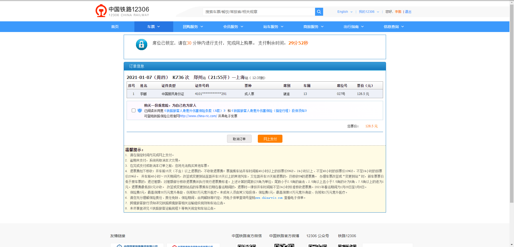

## Selenium 12306 自动抢票

### Python support
  - [ ] 2.7.10 - 2.7.15
  - [x] 3.6 - 3.8
  - [ ] 2.7.9

### Feature
  - [x] 自动打码
  - [x] 自动登录
  - [x] 准点预售和捡漏
  - [ ] 智能候补
  - [ ] 邮件通知
  - [x] server酱通知
  
### Installation

> 目前只测试过 `windows`,`linux`和`macos`没有测试过

### ChromeDriver

`ChromeDriver`[下载地址](https://npm.taobao.org/mirrors/chromedriver/)

> 跟 `Chrome` 大版本保持一致 

#### 安装 pip 依赖

```bash
pip install -r requirement.txt
```

#### 修改配置文件

> 将 config_example.py 复制为 config.py

```python
# 打码服务器配置
code_server = {
    'host': '12306.yinaoxiong.cn',
    'scheme': 'https',
    'path': '/verify/base64/'
}

# 邮箱配置 暂不支持
mail = {
    "enable": False
}

# Server酱 http://sc.ftqq.com/3.version
ftqq_server = {
    "enable": False,
    "sckey": ""
}

# 出发时间
from_time = '2021-01-22'
# 选择车次
trains = ['G412']
# 选择座位
seat_types = ["一等座", "二等座"]
# 选择乘坐人
passengers = ['XXX']
# 12306 用户名
username = '131xxx12345'
# 12306 密码
password = 'abc123'
# 出发地
from_station = '上海'
# 目的地
to_station = '北京'
# 开始售票时间
start_time = '05:00:00'
# 停止售票时间
end_time = '23:00:00'
# ChromeDriver 运行路径
CHROME_PATH = 'D:\\chromedriver.exe'
```

### Code Server

> 默认使用[12306_code_server](https://github.com/YinAoXiong/12306_code_server)云打码服务器

也可以自建打码服务器:

#### docker 部署

```bash
docker run -d -p 8080:80 --name 12306 yinaoxiong/12306_code_server
```

#### docker-compose 部署

```yaml
version: "3"

services:
  code_12306:
    image: yinaoxiong/12306_code_server
    ports:
      - 5002:80 #可以根据需要修改端口
    environment:
      - WORKERS=1 #gunicorn works 默认为1可以根据服务器配置自行调整
    restart: always
```

然后修改 `config.py` 的 `code_server` 配置项

### Usage

```bash
python main.py
```

